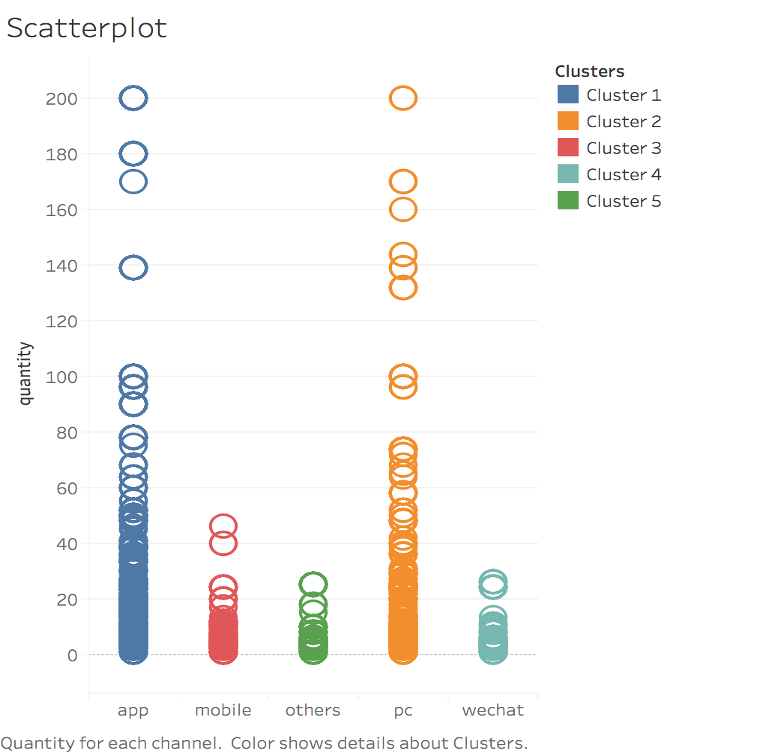
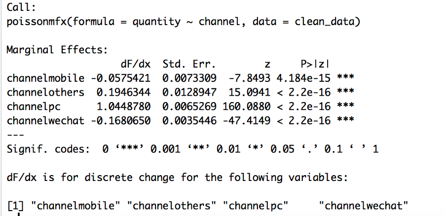

## EFFECT OF APP ON FIRST PARTY QUANTITIES SOLD
**Aim:** The aim of this report is to study the relationship between channels JD.com used and the quantity of the first party owned items sold

**Method:** The data on orders.csv and clicks.csv were used for transactions conducted on March 2018. Items with original unit price were dropped to avoid NaN observations when obtaining of the rate of discount. A Poisson regression was used to estimate the effects of channels on type 1 quantities sold and the rate of discount was later added in further regressions. A logit model was also conducted to examine the relationship between channel and probability of having more than 1 quantity sold.

**Result:** Designating app as the base channel, using ‘other’ channel and ‘pc’ instead of app increases quantity of sales by 0.193 and 1.00 respectively. However, using ‘mobile’ and ‘wechat’ instead of the app decreases sales by 0.057 and 0.174 respectively. After taking into account effects of discounts, results still provided similar results albeit at a smaller degree. All results are statistically significant (p<0.001).

## METHODS AND DATA
This report used March 2018 transactions on JD.com. Orders database was filtered for type 1 items and then inner joined with clicks database by ‘sku_ID’ and ‘user_ID’ to input the channel column. Channel column was changed to factor to show the quantity sold by each channel. Summary of the data is as follows: 

Figure 1

The quantity column follow a power law distribution.

Figure 2

Discount rate was used instead of absolute value dollar of the discount using the formula discount rate=(Discount price)/(original unit price). Therefore, observations wherein original unit price is 0 was removed as these might have been errors. Discount rate observations were accordingly saved under 'direct_discount_per_unit', 'quantity_discount_per_unit' and 'bundle_discount_per_unit'. Columns pertaining to date and unique identification numbers for items and customers were removed as it was not utilised. The quantity column was dichotomised to impute the value of 1 for quantity sold more than 1 and 0 otherwise. Thereafter the values were saved in a column called ‘quantity_more’. 

## PRELIMINARY ANALYSIS
Scatterplot of the distribution of quantity sold is as shown:

Figure 3

We can see that ‘app’ and ‘pc’ are the most common channel users use to obtain type 1 goods. 

When channels are grouped according to ‘quantity_more’ column, it still showed that for quantities greater than 1, the app is still the most popular channel used by users.

Figure 4

Below, it can be seen that the average direct discount was highest at ‘other’ channel for both quantities sold more than once and otherwise. 

Figure 5

Unsurprisingly average quantity discount is more common for quantity sold more than one for all channels (Figure 6) with ‘other’ channel having the highest mean discount. 

Figure 6

As for gift discount, the app channel was the only medium used in the final dataset (Figure 7). It is noteworthy that there are only 5 observations wherein an item was given as a gift.

Figure 7

The effects of bundle discount on channels was not graph as the median observation is 0 and the mean being 0.005339. The observations are then close to 0 thus it is difficult to show relationship through graph. 

## REGRESSION ANALYSIS
A Poisson model was used as quantities sold are discrete observations thus it is more appropriate to use this model instead of an OLS regression which is more suitable for continuous variable. 

Figure 8

Marginal effects of the Poisson model are shown in Figure 8 which showed that using mobile and wechat, instead of an app, decreases the quantity sold through by 0.057 and 0.168 respectively. Using other and pc instead of the app increases sales by 0.195 and 1.05 respectively. The AIC score is 4246000. When the four type discounts were also taken into account as shown in Figure 9, using mobile and wechat instead of app decreases quantity sold by 0.01 and 0.06 respectively. Using others and pc instead of app increases quantities sold by 0.09 and 1.02. Taking the discounts into consideration dampen the effects of each channel. The AIC score is 4170000. Both regressions have statistically significant results.

Figure 9

When the dependent variable was changed to quantity – 1 to account for Poisson’s limits {0 to positive real numbers} or quantity sold being zero, the absolute value of the marginal effects of the channel was reduced (Figure 10). 

Figure 10

Using mobile and wechat instead of app still decreases quantity sold by 0.057 and 0.173 respectively while using others and pc increases sales by 0.193 and 1.00 respectively. The AIC score is 3078000. When discounts were taken into consideration and dependent variable is quantity-1 (Figure 11), using mobile and wechat instead of app decreases sales by 0.016 and 0.072 respectively while using others and pc instead of app increases quantities sold by 0.066 and 0.741 correspondingly. The AIC score is 2797000.

Figure 11

The above regression gives the best fit as it has the lowest AIC score. This could be because 0 quantity sold was taken into account which could be possible if the item ‘sold’ is a gift. Moreover, effects of the other discounts were taken into account which affects the popularity of each channel.

Figure 12

As for the logit model, when only channel was considered (Figure 12) and dependent variable is ‘quantity_more’, using mobile and wechat instead of app decreases the probability of selling more than one by 0.008 and 0.054 while using others and pc instead of app increases probability of selling more than 1 quantity by 0.091 and 0.055 correspondingly. The AIC for this is 1343000. When the effects of discount were also considered (Figure 13), using wechat instead of app decreases the probability by 0.008. 

Figure 13

However, using mobile others and pc instead of app increases the probability of selling more than one according to the values in Figure 14. The AIC score is 1224000.

Figure 14

## CONCLUSION
By looking at the scatterplot and group by of quantity sold more than 1 for each channel, it might indicate a prima facie evidence that first party products are better sold at the app. Although items given as gift_item still indicate as quantity sold, it is noteworthy that only 5 observations are given as gift which is not economically significant in a 1.4 million observations. In general, having the app has a positive correlation on type 1 items instead of mobile and wechat channel. Since average direct discount and quantity discount is highest in others channel, it may lead to positive correlation in quantities sold in others channel. The average quantity discount is highest in pc thus might result to the positive correlation on quantities sold. A plausible recommendation to increase sales in app is to implement higher discounts in app channel. 

The following are limitations of this data:
*	The observations are only for March 2018 thus it may not be generalised especially for peak seasons such as Christmas, Singles Day etc where quantities sold may be higher. 
*	Marketing efforts such as popups were not taken into consideration when collating the data
*	Other type of discount may not have been taken into consideration.
*	For products given as gifts, quantity sold was still recorded as 1. This could overestimate the quantities sold. 

